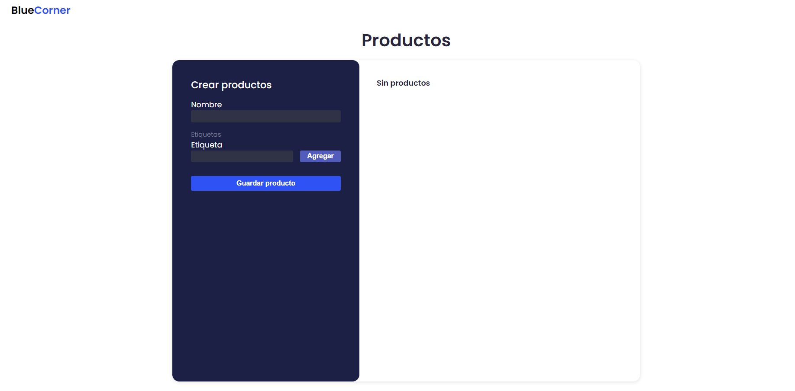

# BlueCorner

=======
# BlueCorner - Prueba Técnica
Aplicación realiza en el ámbito de una entrevista técnica

<p align="center">
  
</p>

## Requerimientos 📋
1. Crear una Base de Datos en MySql, para eso puedes ingresa la shell de MySql y colocar
 ```
CREATE DATABASE BlueCornerDB
```
2. En el archivo ./server/config.js colocar tus credenciales

## Instalación 🔧
Usar el manejador de paquetes NPM, recordar estar parado tanto en la carpeta "server" como en "client"

cd ./server
```
npm install 
```
cd ./client
```
npm install 
```

## Correr en local⚙️
cd ./server
```
npm run dev 
```
cd ./client
```
npm start 
```

Disfrutar 😊

